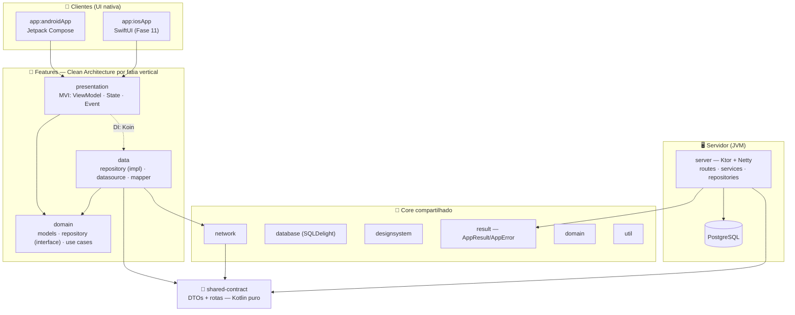

<div align="center">

# 🏋️ FitJourney

**App de fitness gamificado — treino por IA ou manual, grupos privados com check-in validado, progresso e recompensas. Construído como monorepo Kotlin Multiplatform com backend próprio em Ktor.**

*Android primeiro · iOS depois · lógica de negócio compartilhada, UI nativa em cada plataforma.*

[](https://kotlinlang.org)
[](https://kotlinlang.org/docs/multiplatform.html)
[](https://developer.android.com/jetpack/compose)
[](https://ktor.io)
[](https://www.postgresql.org)
[](.github/workflows/ci.yml)
[](konsist/)
[](LICENSE)

</div>

> **⚠️ Status: em desenvolvimento ativo (marco M3).** A fundação de engenharia — modularização, backend, contrato de API, autenticação, onboarding, CI e testes de arquitetura — está construída e validada ponta a ponta. As features de produto avançam por fatias verticais. Este README apresenta a **visão completa** do produto, sinalizando o que já está pronto (✅), em andamento (🚧) e planejado (📋).

---

## 📑 Índice

- [Sobre o projeto](#-sobre-o-projeto)
- [Pilares do produto](#-pilares-do-produto)
- [Destaques de engenharia](#-destaques-de-engenharia)
- [Arquitetura](#️-arquitetura)
- [Decisões de arquitetura](#-decisões-de-arquitetura)
- [Stack tecnológica](#️-stack-tecnológica)
- [Estrutura do repositório](#-estrutura-do-repositório)
- [API do servidor](#-api-do-servidor)
- [Modelo de dados](#️-modelo-de-dados)
- [Design system](#-design-system)
- [Qualidade e automação](#-qualidade-e-automação)
- [Como executar](#-como-executar)
- [Testes](#-testes)
- [Roadmap](#️-roadmap)
- [Licença](#-licença)
- [Autor](#-autor)

---

## 🎯 Sobre o projeto

O **FitJourney** é um aplicativo de fitness gamificado, para todos os níveis, que une registro de treino, criação de treino por IA ou manual (100% editável), grupos privados com check-in validado por amigos, progresso, recompensas e uma biblioteca de conhecimento. O tom é amigável e motivador — sério na medida, nunca infantil nem intimidador.

O diferencial não está apenas no produto, mas na forma como é construído: **um único monorepo Kotlin Multiplatform** onde a lógica de negócio, os modelos de domínio e o contrato da API são escritos uma única vez e compartilhados entre o app Android, o app iOS e um servidor JVM próprio. A UI é **nativa em cada plataforma** (Jetpack Compose no Android, SwiftUI no iOS), enquanto a camada de apresentação (ViewModel/State/Event) e todo o resto ficam compartilhados.

O projeto foi estruturado desde o primeiro commit com práticas de projetos de larga escala: modularização por *feature* e por *camada*, fronteiras de arquitetura garantidas por testes automatizados, backend próprio com banco versionado, e integração contínua.

---

## 🧩 Pilares do produto

| Pilar | Descrição | Status |
|---|---|:---:|
| 🏋️ **Treino** | O núcleo. Criar (IA ou manual), editar 100%, executar a sessão ao vivo com timer, ver o resumo pós-treino. | 🚧 |
| 👥 **Social** | Grupos privados com check-in por foto validado pelos pares — o maior motor de retenção. | 📋 |
| 🏆 **Gamificação** | XP, nível, conquistas e ranking como camada de recompensa (identidade visual lime). | 📋 |
| 📈 **Progresso** | Histórico, recordes, volume e streak. | 📋 |
| 📚 **Conhecimento** | Biblioteca curada sobre o básico de academia. | 📋 |

**Check-in validado (mecânica social central):** ao enviar um check-in com foto, o XP entra como *pendente* e é confirmado quando 50% dos membros elegíveis validam ou após 24h sem contestação. Confiança por padrão, com moderação de imagem e fotos visíveis apenas dentro do grupo.

**Monetização *value-first*:** o paywall aparece só depois de o valor ter sido demonstrado no onboarding, sempre com um tier grátis útil. Premium libera IA ilimitada, progressão inteligente, grupos ilimitados e análises avançadas.

---

## ✨ Destaques de engenharia

| | |
|---|---|
| 🧩 **16 módulos Gradle** | Organizados por *feature* (`auth`, `profile`, …) e por *camada* (`domain`, `data`, `presentation`), com um núcleo de módulos `core` reutilizáveis. |
| 🔗 **Contrato compartilhado** | O módulo `shared-contract` centraliza os DTOs trocados entre cliente e servidor — zero duplicação, zero divergência entre front e back. |
| 🛡️ **Arquitetura testada** | Testes [Konsist](https://github.com/LemonAppDev/konsist) falham o build se qualquer fronteira de camada for violada (ex.: `domain` não pode enxergar `data`; uma feature não pode depender de outra). |
| ⚙️ **Convention plugins** | *Convention plugins* Gradle próprios (`build-logic`) encapsulam a configuração de build por tipo de módulo (puro / cliente / cliente+Compose), preservando a fronteira "domain é puro". |
| 🚀 **Backend próprio** | Servidor Ktor com PostgreSQL, pool de conexões (HikariCP), migrations versionadas (Flyway) e autenticação Firebase. |
| ⚡ **Erro como fluxo funcional** | Um tipo `AppResult`/`AppError` (estilo *railway-oriented*) percorre as rotas; `StatusPages` é apenas a rede de segurança. |
| 🔄 **CI/CD** | GitHub Actions valida o wrapper, roda o lint de arquitetura e executa build + testes do servidor a cada push e PR. |
| 📦 **Version catalog** | `libs.versions.toml` como fonte única de versões, com *type-safe project accessors* habilitados. |
| 🐳 **Ambiente containerizado** | `docker-compose` sobe o PostgreSQL local com healthcheck, pronto para desenvolvimento. |

---

## 🏛️ Arquitetura

O projeto segue **Clean Architecture** por feature, aplicada ao contexto multiplataforma. A dependência sempre desce: apps e servidor consomem as camadas abaixo, e nada de baixo conhece quem está acima. O código compartilhado vive em `commonMain`; apenas o que é obrigatório (ex.: driver de banco, UI) é específico de plataforma via `expect/actual`.



**Regra de ferro:** uma feature **nunca** depende de outra feature. O que é comum (ex.: `User`) sobe para o `core`, e a comunicação entre features passa pela navegação.

**Lógica autoritativa no servidor:** regras de XP, validação de check-in e geração de treino por IA são autoridade do backend. O cliente mantém cópias otimistas para a UI responder rápido, mas a verdade vem do servidor.

---

## 🧠 Decisões de arquitetura

Decisões deliberadas de engenharia, registradas ao longo do desenvolvimento:

| # | Decisão | Racional |
|:---:|---|---|
| **#4** | Erro como fluxo funcional (`AppResult`) | Rotas retornam `AppResult`; `StatusPages` é apenas rede de segurança para `Throwable` inesperado. |
| **#5** | Flyway roda no boot, não como task Gradle | `migrate()` no `DatabaseFactory.init`, antes do `Database.connect` — ambiente sempre consistente. |
| **#6** | Três convention plugins por necessidade | *puro / cliente / cliente+Compose* — mantém "domain é puro" como fronteira real, não convenção. |
| **#7** | Koin como DI também no servidor | Tornou o `TokenVerifier` injetável e testável (a doc original previa Koin só no cliente). |
| **#8** | UI nativa por plataforma | Compose no Android, SwiftUI no iOS; apenas a lógica (ViewModel/State/Event) é compartilhada. |
| **#11** | Offline leve (não offline-first pleno) | Cache de leitura local (catálogo + treinos); escrita online. Verdade no back, cópias otimistas no front. |

---

## 🛠️ Stack tecnológica

Legenda: ✅ em uso · 📋 planejado (adotado por fase, conforme o roadmap)

### Compartilhado (cliente + servidor)
| Tecnologia | Uso | |
|---|---|:---:|
| **Kotlin 2.4** | Linguagem única em todo o stack | ✅ |
| **Kotlin Multiplatform** | Alvos Android · iOS · JVM | ✅ |
| **kotlinx.serialization** | Serialização dos DTOs do contrato | ✅ |
| **kotlinx.coroutines** | Programação assíncrona | ✅ |
| **kotlinx.datetime** | Datas multiplataforma | ✅ |

### Cliente
| Tecnologia | Uso | |
|---|---|:---:|
| **Jetpack Compose** | UI nativa Android | ✅ |
| **SwiftUI** | UI nativa iOS | 📋 |
| **Koin** | Injeção de dependência | ✅ |
| **Ktor Client** | Consumo da API (OkHttp/Android, Darwin/iOS) | ✅ |
| **GitLive Firebase** | Auth Firebase multiplataforma | ✅ |
| **StateFlow + ViewModel (MVI)** | Estado e apresentação | ✅ |
| **SQLDelight** | Cache/persistência local | 📋 |
| **Compose Navigation** | Navegação (grafo real na Fase 4) | 📋 |
| **Coil 3** | Carregamento de imagens | 📋 |
| **Kermit** | Logging multiplataforma | 📋 |

### Backend
| Tecnologia | Uso | |
|---|---|:---:|
| **Ktor 3.5 + Netty** | Servidor HTTP | ✅ |
| **Exposed** | ORM/DSL SQL da JetBrains | ✅ |
| **HikariCP** | Pool de conexões | ✅ |
| **PostgreSQL** | Banco relacional (dados profundamente relacionais + ACID) | ✅ |
| **Flyway** | Migrations versionadas | ✅ |
| **Firebase Admin** | Verificação de token / autorização | ✅ |
| **Koin** | Injeção de dependência no servidor | ✅ |
| **Redis** | Ranking em escala (sorted sets) | 📋 |
| **WebSockets** | Tempo real (polling no MVP) | 📋 |
| **LLM via backend** | Geração de treino por IA (validada no servidor) | 📋 |

### Serviços e integrações
| Necessidade | Escolha | |
|---|---|:---:|
| Assinatura / trial | **RevenueCat** (Play Billing + App Store) | 📋 |
| Fotos do check-in | **Cloudflare R2 + CDN** (Postgres guarda só URL/metadados) | 📋 |
| Moderação de imagem | **Rekognition / Hive** (obrigatória antes de publicar) | 📋 |
| Push | **Firebase Cloud Messaging** (+ APNs no iOS) | 📋 |
| Analytics / flags | **PostHog** (funil de trial + A/B reverse trial) | 📋 |
| Crash reporting | **Sentry** | 📋 |

### Build & Qualidade
| Tecnologia | Uso | |
|---|---|:---:|
| **Gradle** (convention plugins) | Build modularizado com `build-logic` | ✅ |
| **Version Catalog** | Fonte única de versões (`libs.versions.toml`) | ✅ |
| **Konsist** | Testes de arquitetura | ✅ |
| **Testcontainers · H2 · ktor-server-test-host** | Testes de integração e de servidor | ✅ |
| **GitHub Actions** | Integração contínua | ✅ |
| **Docker Compose** | PostgreSQL local | ✅ |
| **Fastlane** | Publicação nas lojas | 📋 |
| **Turbine · Mokkery · Maestro** | Testes de fluxo, mocks e E2E | 📋 |

---

## 📁 Estrutura do repositório

Pacote raiz: `dev.rafael` — `core` em `dev.rafael.core.*`, features em `dev.rafael.features.<f>.*`, servidor em `dev.rafael.server`, contrato em `dev.rafael.contract`.

```
FitJourney/
├── app/
│   └── androidApp/            # App Android (Compose): Login + Quiz de onboarding
├── server/                    # Backend Ktor + PostgreSQL
│   └── src/main/resources/
│       └── db/migration/      # Migrations Flyway (V1..V5)
├── shared/
│   ├── core/
│   │   ├── network/           # Cliente HTTP, TokenProvider
│   │   ├── database/          # Persistência local (SQLDelight)
│   │   ├── designsystem/      # Tema FitJourney (cores, tipografia, shapes)
│   │   ├── domain/            # Entidades transversais (User, Session)
│   │   ├── result/            # AppResult / AppError (erro funcional)
│   │   └── util/              # Utilitários
│   └── features/
│       ├── auth/              # domain · data · presentation
│       └── profile/           # domain · data · presentation
├── shared-contract/           # DTOs + rotas compartilhados cliente ⇄ servidor
├── konsist/                   # Testes de arquitetura
├── build-logic/               # Convention plugins Gradle
├── docker-compose.yml         # PostgreSQL local
├── .env.example               # Variáveis de ambiente
└── gradle/libs.versions.toml  # Version catalog
```

**Módulos Gradle** (`settings.gradle.kts`): `:app:androidApp`, `:server`, `:shared-contract`, `:konsist`, `:shared:core:{network,database,designsystem,domain,result,util}`, `:shared:features:auth:{domain,data,presentation}`, `:shared:features:profile:{domain,data,presentation}`.

---

## 🌐 API do servidor

A API expõe recursos REST com respostas em JSON. As rotas de dados exigem autenticação via token Firebase (`Authorization: Bearer`); o backend valida o token com o Firebase Admin SDK, extrai o `uid` e, no primeiro acesso, cria o usuário no Postgres usando o `firebase_uid` como chave. Erros seguem um envelope consistente (`ErrorResponse`) definido no `shared-contract`.

| Método | Rota | Auth | Descrição | Status |
|---|---|:---:|---|:---:|
| `GET` | `/health` | — | Health check (status do serviço e do banco) | ✅ |
| `GET` | `/me` | 🔒 | Dados do usuário autenticado | ✅ |
| `GET` `PUT` | `/me/profile` | 🔒 | Perfil de treino (objetivo, nível, áreas de foco) | ✅ |
| `GET` | `/exercises?category=` | 🔒 | Catálogo de exercícios (filtro por categoria) | ✅ |
| `POST` | `/workouts` | 🔒 | Cria um treino | ✅ |
| `GET` | `/workouts` | 🔒 | Lista os treinos do usuário | ✅ |
| `GET` | `/workouts/{id}` | 🔒 | Detalha um treino | ✅ |
| `PUT` | `/workouts/{id}` | 🔒 | Atualiza um treino (substitui o agregado) | ✅ |
| `DELETE` | `/workouts/{id}` | 🔒 | Remove um treino | ✅ |

**Validação autoritativa:** a criação de um treino valida o nome, exige ao menos um exercício com uma série válida (reps > 0) e confere se todos os exercícios existem no catálogo antes de persistir — tudo com o tipo funcional `AppResult`, convertido para HTTP via `StatusPages`.

---

## 🗄️ Modelo de dados

O schema é versionado com **Flyway** (executado no boot) e evolui de forma incremental e reprodutível:

| Migration | Conteúdo |
|---|---|
| `V1__create_users` | Usuários (com `firebase_uid`) |
| `V2__create_profiles` | Perfis de treino (objetivo, nível, áreas de foco em JSON) |
| `V3__create_exercises` | Catálogo de exercícios |
| `V4__seed_exercises` | Seed de **963 exercícios** em **16 categorias** |
| `V5__create_workouts` | Treinos, exercícios do treino e séries (hierarquia agregada) |

**Modelagem do treino:** treino = *plano* (sem peso; o peso pertence à execução ao vivo). Hierarquia: `treino → workout_exercise` (FK para o catálogo + ordem) `→ série` (reps + ordem). O CRUD opera sobre o agregado inteiro; o `PUT` substitui.

**Enums do domínio** (compartilhados via `shared-contract`):
- **Objetivo:** `GAIN_MUSCLE`, `LOSE_FAT`, `MAINTAIN`, `GENERAL_HEALTH`
- **Nível:** `BEGINNER`, `INTERMEDIATE`, `ADVANCED`
- **Grupos musculares:** `CHEST`, `BACK`, `ARMS`, `SHOULDERS`, `LEGS`, `GLUTES`, `CORE`
- **Categorias de exercício:** 16 no total, incluindo `FUNCTIONAL_HIT`, `MOBILITY`, `CALISTHENICS`, `CROSSFIT`, `CARDIO`, além dos grupos musculares.

---

## 🎨 Design system

Construído sobre **Material 3 Expressive**, com direção amigável e motivadora: cores vivas, cantos arredondados e movimento com física de mola.

| Papel | Cor | Uso |
|---|---|---|
| **primary** | `#F94E2E` | Coral — energia / ação |
| **secondary** | `#4A3DE6` | Índigo — foco / disciplina / IA |
| **reward** | `#B7E62E` | Lime — **exclusivo** de XP, nível e conquistas |
| **success / warning / error** | `#15A66B` · `#FF9F1A` · `#E5484D` | Estados |
| **surface** | `#FAF7F4` | Fundo branco-quente |

**Semântica do lime:** sempre que aparece, significa recompensa — o usuário aprende que verde-lima = progresso. Nunca em botões comuns.

**Tipografia:** *Unbounded* (títulos/números grandes), *Plus Jakarta Sans* (corpo/UI) e *Space Mono* (dados: XP, reps, peso, timer). **Assinatura visual:** barra de progresso ondulada (*wavy*) na barra de XP e *shapes* decorativos (*scalloped*) nos medalhões de conquista.

---

## ✅ Qualidade e automação

### Testes de arquitetura (Konsist)
O módulo `konsist` transforma as regras de Clean Architecture em **testes executáveis**. Em vez de confiar em revisão manual, o build falha automaticamente se uma fronteira for cruzada — cobrindo a pureza do `shared-contract`, o isolamento dos módulos `core`, a independência do servidor em relação ao cliente, a pureza da camada `domain` e a proibição de dependências entre features.

### Integração contínua (GitHub Actions)
O workflow [`ci.yml`](.github/workflows/ci.yml) roda a cada `push` e `pull_request` nas branches `main` e `develop`:

1. ✔️ **Validação do Gradle wrapper** (previne wrappers adulterados)
2. ☕ Configuração de **JDK 17** (mesma *toolchain* do projeto)
3. 🛡️ **Lint de arquitetura** — `./gradlew :konsist:test`
4. 🧪 **Build & testes do servidor** — `./gradlew :server:build`

O repositório também inclui **branch protection** na `main` e um **template de Pull Request** padronizado.

---

## 🚀 Como executar

### Pré-requisitos
- **JDK 17**
- **Docker** e **Docker Compose** (para o PostgreSQL)
- **Android Studio** (compatível com AGP 9) para o app Android
- **Xcode** (em macOS) para o app iOS

### 1. Clone o repositório
```bash
git clone https://github.com/FitJourneyOrg/FitJourney.git
cd FitJourney
```

### 2. Configure as variáveis de ambiente
```bash
cp .env.example .env
# Edite .env com suas credenciais (POSTGRES_*, FIREBASE_CREDENTIALS_PATH)
```

### 3. Suba o banco de dados
```bash
docker compose up -d
```

### 4. Rode o servidor
```bash
./gradlew :server:run
# Health check em http://localhost:8080/health
```

### 5. Rode o app Android
```bash
./gradlew :app:androidApp:assembleDebug
```

### 6. Rode o app iOS
Abra o diretório `app/iosApp` no Xcode e execute a partir de lá.

---

## 🧪 Testes

```bash
# Testes de arquitetura
./gradlew :konsist:test

# Testes do servidor (inclui integração de migrations e verificação de token)
./gradlew :server:test

# Testes iOS (lógica compartilhada)
./gradlew :app:sharedLogic:iosSimulatorArm64Test
```

A suíte de servidor utiliza **Testcontainers** (PostgreSQL real em container), **H2** (banco em memória) e **ktor-server-test-host** para testes de rota.

---

## 🗺️ Roadmap

Do esqueleto ao deploy — backend primeiro, cliente depois, feature por feature na vertical. Cada fase só começa quando a anterior está estável.

| Fase | Título | Marco | Status |
|:---:|---|:---:|:---:|
| 0 | Fundação & Tooling | — | ✅ |
| 1 | Backend base (Ktor + Postgres + Flyway + Firebase Admin) | — | ✅ |
| 2 | Autenticação (vertical) | **M2** | ✅ |
| 3 | Onboarding (perfil + quiz) | — | ✅ |
| 4 | Treino (núcleo: catálogo + CRUD + IA + sessão ao vivo) | **M3** | 🚧 |
| 5 | Progresso & Gamificação (XP, nível, conquistas, ranking) | — | 📋 |
| 6 | Grupos + check-in validado (R2 + moderação) | **M4** | 📋 |
| 7 | Trial & Assinatura (RevenueCat, paywall, A/B) | **M5** | 📋 |
| 8 | Conhecimento & Notificações (biblioteca + FCM) | — | 📋 |
| 9 | Qualidade & Operação (Sentry, PostHog, testes, hardening) | — | 📋 |
| 10 | Beta & Deploy Android (Data Safety, compliance) | **M6** | 📋 |
| 11 | iOS (SwiftUI, Sign in with Apple, APNs, App Store) | **M7** | 📋 |

**Marcos:** M2 login ponta a ponta · M3 loop de treino jogável · M4 social + gamificação · M5 monetização · M6 beta Android · M7 launch iOS.

---

## 📄 Licença

Distribuído sob a licença **MIT**. Veja [`LICENSE`](LICENSE) para mais informações.

---

## 👤 Autor

Desenvolvido por **[@devrafaah](https://github.com/devrafaah)**.

---

<div align="center">

⭐ Se este projeto te interessou, considere deixar uma estrela!

</div>
